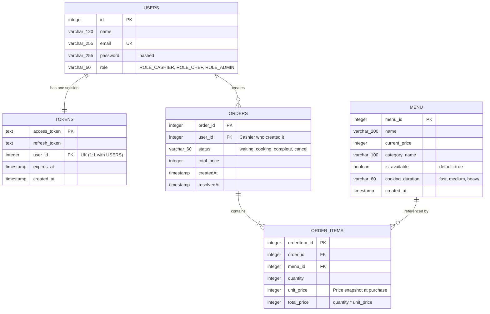

# POS + KDS Database Design

This document details the database schema designed for the Point of Sale (POS) and Kitchen Display System (KDS). The design focuses on a streamlined, automated workflow between the Cashier and Kitchen Staff (Chef) without requiring a manual Manager role.

---

## Entity Relationship Diagram

---

## Tables Dictionary

### 1. `users`
Stores credentials and roles for authentication and authorization. Registration is disabled for cashiers and chefs; accounts are pre-seeded or managed by an admin.

| Column Name | Type | Key | Description |
| :--- | :--- | :--- | :--- |
| `id` | `INTEGER` | PK, Auto-Increment | Unique identifier for the user. |
| `name` | `VARCHAR(120)` | | Full name of the user. |
| `email` | `VARCHAR(255)` | Unique | Email address used for login. |
| `password` | `VARCHAR(255)` | | Cryptographically hashed password. |
| `role` | `VARCHAR(60)` | | Security role: `ROLE_CASHIER`, `ROLE_CHEF`, `ROLE_ADMIN`. |

### 2. `tokens`
Tracks JWT access/refresh tokens for revocation and expiration checking. The database enforces a `1:1` relationship with `users` to support single-device logins only.

| Column Name | Type | Key | Description |
| :--- | :--- | :--- | :--- |
| `access_token` | `TEXT` | PK | The cryptographic access token. |
| `refresh_token` | `TEXT` | | The refresh token used to get new access tokens. |
| `user_id` | `INTEGER` | FK, Unique | References `users(id)`. Unique constraint enforces single-device session. |
| `expires_at` | `TIMESTAMP` | | Expiration timestamp of the access token. |
| `created_at` | `TIMESTAMP` | | Timestamp when the token was issued. |

### 3. `menu`
Stores the master food and beverage menu items. 

| Column Name | Type | Key | Description |
| :--- | :--- | :--- | :--- |
| `menu_id` | `INTEGER` | PK, Auto-Increment | Unique identifier for the menu item. |
| `name` | `VARCHAR(200)` | | Display name of the food/drink item. |
| `current_price` | `INTEGER` | | Active price of the item on the menu. |
| `category_name` | `VARCHAR(100)`| | Category (e.g., Drinks, Mains, Sides). |
| `is_available` | `BOOLEAN` | | Availability toggle. Chef switches this to `false` in KDS to sync sell-out. |
| `cooking_duration`| `VARCHAR(60)` | | Preparation duration tier: `fast`, `medium`, `heavy`. |
| `created_at` | `TIMESTAMP` | | Date and time the menu item was created. |

### 4. `orders`
Represents customer tickets created by Cashiers. Status is tracked globally at the order level to keep the kitchen workflow simple.

| Column Name | Type | Key | Description |
| :--- | :--- | :--- | :--- |
| `order_id` | `INTEGER` | PK, Auto-Increment | Unique identifier for the order ticket. |
| `user_id` | `INTEGER` | FK | References `users(id)` (Cashier who placed the order). |
| `status` | `VARCHAR(60)` | | Preparation state: `waiting`, `cooking`, `complete`, `cancel`. |
| `total_price` | `INTEGER` | | Overall order total. |
| `createdAt` | `TIMESTAMP` | | When the cashier created the order. |
| `resolvedAt` | `TIMESTAMP` | | When the order was marked `complete` or `cancel`. |

### 5. `order_items`
Contains the specific items purchased within an order.

| Column Name | Type | Key | Description |
| :--- | :--- | :--- | :--- |
| `orderItem_id` | `INTEGER` | PK, Auto-Increment | Unique identifier for the line item. |
| `order_id` | `INTEGER` | FK | References `orders(order_id)`. |
| `menu_id` | `INTEGER` | FK | References `menu(menu_id)`. |
| `quantity` | `INTEGER` | | Number of units ordered. |
| `unit_price` | `INTEGER` | | **Price snapshot** at the time of purchase. Prevents historical audit changes. |
| `total_price` | `INTEGER` | | Subtotal for this line item (`quantity * unit_price`). |

---

## Design Rationale

1. **Price Snapshotting:** By copying `unit_price` into `order_items` at purchase time, we ensure historical reports remain correct if menu prices are updated or items are deleted in the `menu` table.
2. **Global Order Status:** Keeping preparation status (`waiting`, `cooking`, `complete`) at the `orders` level ensures the Chef can manage orders as whole "tickets" on the KDS screen, significantly simplifying KDS state management.
3. **Single-Device Restriction:** Enforcing a `Unique` constraint on `tokens(user_id)` ensures that when a cashier or kitchen terminal logs in on a new device, any older token is invalidated, maintaining a strict 1-session-per-user policy.
4. **No-Register Roles:** Security is handled via pre-seeding. Cashiers and chefs cannot sign themselves up; they only log in using credentials created by the Admin/Owner.
